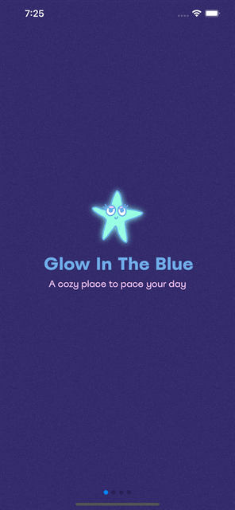

<!-- @format -->

# Glow In The Blue

 


# App GIF



**A cozy place for pacing your day.**

Glow in the Blue is the brainchild of Chumi Gonzalez, Elisa Bennett, Hannah Kemp, and Shannon Chang. We wanted to create a space for people to hold themselves accountable in a thoughtful and supportive way.

Whether making sure they spent time meditating or that they allocated time to exercise, Glow in the Blue is there as a time-allocation buddy for all users. Glow in the Blue allows a variety of activities to be logged and for total times to be accumulated in user analytics. Furthermore, users can create groups to add accountability while competing with friends in a chosen activity. At the end of the allotted group session time, statistics will be revealed.

## Table of Contents

- [Glow in the Blue](https://glowintheblue.herokuapp.com/)
- [Table of Contents](#table-of-contents)
- [Download](#download)
- [Team](#team)
  - [Chumi Gonzalez](#chumi-gonzalez)
  - [Elisa Bennett](#elisa-bennett)
  - [Hannah Kemp](#hannah-kemp)
  - [Shannon Chang](#shannon-chang)
- [Tech Stack](#tech-stack)
- [Current Features](#current-features)
- [Additional Ideas](#additional-ideas)

## Download

Step-by-step guide for downloading the repo:

```
cd <directory you want to download to>

git clone https://github.com/VulpixTribe/glowintheblue.git

npm install

npm start

on a mobile app/tablet, download Expo Go app

scan the QR code:


start Glowing!
```

## Team

### `Chumi Gonzalez`

LinkedIn: https://www.linkedin.com/in/chumi-gonzalez-a434aa74/

Github: https://github.com/chumilanesa

### `Elisa Bennett`

LinkedIn: https://www.linkedin.com/in/elisabennett/

Github: https://github.com/BennettElisa

### `Hannah Kemp`

LinkedIn: www.linkedin.com/in/hannahkemp12

Github: https://github.com/hannahfk

### `Shannon Chang`

LinkedIn: https://www.linkedin.com/in/shannon-chang/

Github: https://github.com/ShannonCH

## Tech Stack

**Overview:**

Instead of “prop drilling” we used the React v16.3.0 Context API which is designed to share data that can be considered “global” for a tree of React components. This eliminated the need to install additional libraries such as Redux for state management and allowed us to manage state effectively within each component.

As a team we believe that building a robust app involves ensuring that everyone can use it, including people with vision loss, reading disabilities or other disabilities. By using the AccessibilityInfo API we’ve insured our app is usable by someone who may need or use assistive technology such as a screen reader.

To further enhance the user experience we audited the app for accessibility with the Accessibility Inspector. By mirroring the actual user experience we were able to catch additional usability issues to resolve within our app.

- React-Native

- Firebase

- Postgres

- Sequelize

- React Hooks

- React Context API

- AccessibilityInfo API

- Node.js

- Heroku

## Current Features

- User can log varying times with selected activities

- User/Timer interaction generates points, which both appear numerically and visually in the form of a counter on the home screen

- User can challenge friends by creating a group

- User and groups can see their statistics of time accrued in each category of activities

- User can visualize statistics in the form of a dynamic pie chart or timeline

- Phone will vibrate when timer is complete

- An email will be sent out as a notification and invititation to the app if invited to a group and the email isn't registered

- A registered user will receive a notification for each invitation received to join a group

## Additional Ideas

- Creating AR items to populate a store

- User can spend points in a store on AR items to beautify their surroundings

- Groups can customize length of challenges

- Android application
